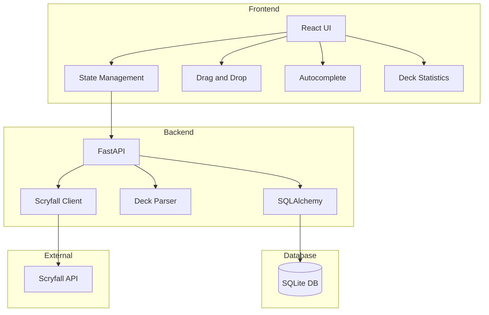
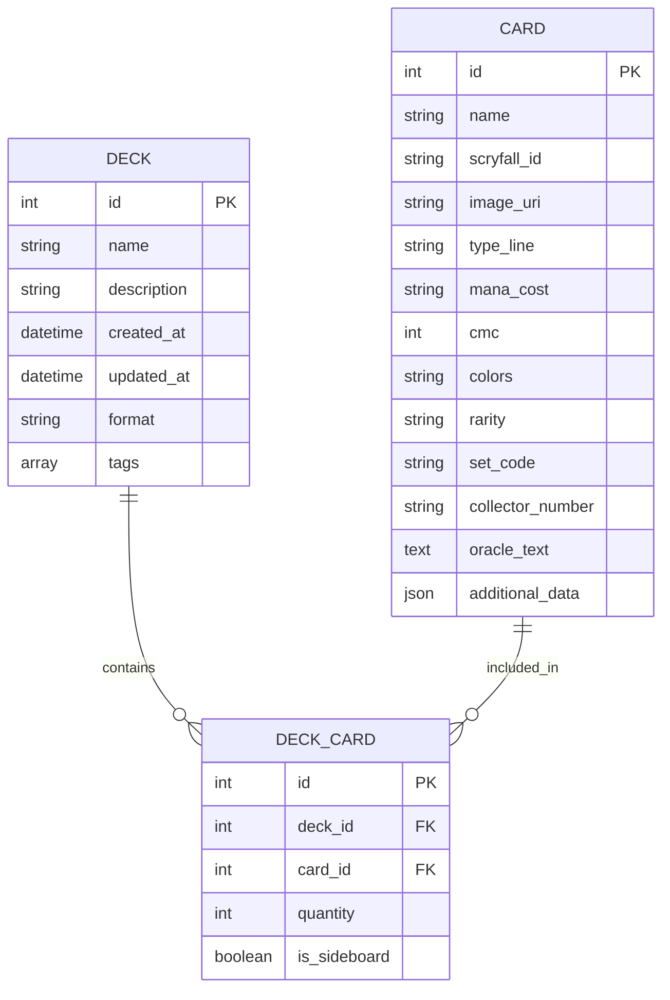

# Magic the Gathering Deck Manager - Project Plan

## 1. Project Overview

We'll build a comprehensive MTG Deck Manager with these key components:
- React frontend with a clean, modern UI and dark mode support
- Python backend API
- SQLite database with a flexible schema
- Integration with Scryfall API for card data

The application will be designed to run locally but with the architecture to support future deployment as a web application.

## 2. Technology Stack

### Frontend
- **Framework**: React with Create React App or Next.js
- **UI Library**: Material-UI or Chakra UI (both support dark mode and provide clean, modern components)
- **State Management**: Redux Toolkit or React Query
- **Drag and Drop**: react-beautiful-dnd or react-dnd
- **Autocomplete**: Downshift or Material-UI Autocomplete
- **Charts/Visualization**: recharts or Chart.js (for mana curve, color distribution)

### Backend
- **Framework**: FastAPI (high performance, easy to use, great documentation, and built-in API docs)
- **ORM**: SQLAlchemy (for flexible database schema)
- **API Client**: httpx (for Scryfall API integration)
- **Authentication**: JWT (for future deployment)
- **Virtual Environment**: venv

### Database
- **SQLite**: For local development
- **Migration Tool**: Alembic (for schema evolution)

### Development Tools
- **Package Manager**: npm/yarn (frontend), pip (backend)
- **Linting/Formatting**: ESLint/Prettier (frontend), Black/isort (backend)
- **Version Control**: Git
- **API Documentation**: Swagger UI (built into FastAPI)

## 3. System Architecture

## 4. Database Schema

This schema is flexible and can be extended with additional tables or fields as needed.

## 5. Feature Implementation Plan

### Phase 1: Project Setup and Basic Structure
1. Set up React frontend project
2. Set up Python backend with FastAPI
3. Configure SQLite database with SQLAlchemy
4. Implement basic API endpoints
5. Set up project structure and navigation

### Phase 2: Core Functionality
1. Implement deck parser for MTGA text format
2. Integrate with Scryfall API
3. Develop deck listing and viewing functionality
4. Implement card detail view
5. Create basic deck editing capabilities

### Phase 3: Advanced Features
1. Implement drag-and-drop deck builder
2. Add autocomplete search for cards
3. Develop deck statistics (mana curve, color distribution)
4. Implement tagging and categorization system
5. Add dark mode support

### Phase 4: Polish and Additional Features
1. Improve UI/UX with animations and transitions
2. Add export functionality to different formats
3. Implement deck comparison tools
4. Add deck suggestions or recommendations
5. Optimize performance and responsiveness

## 6. API Endpoints

### Decks
- `GET /api/decks` - List all decks
- `GET /api/decks/{id}` - Get deck details
- `POST /api/decks` - Create a new deck
- `PUT /api/decks/{id}` - Update a deck
- `DELETE /api/decks/{id}` - Delete a deck
- `POST /api/decks/import` - Import a deck from MTGA text format

### Cards
- `GET /api/cards` - Search cards (with filters)
- `GET /api/cards/{id}` - Get card details
- `GET /api/cards/autocomplete` - Autocomplete card names

### Statistics
- `GET /api/decks/{id}/stats` - Get deck statistics

## 7. Frontend Routes and Components

### Routes
- `/` - Dashboard/Home
- `/decks` - Deck listing
- `/decks/new` - Create new deck
- `/decks/{id}` - View deck details
- `/decks/{id}/edit` - Edit deck
- `/cards` - Card search/browser

### Key Components
- `DeckList` - List of decks with filtering and sorting
- `DeckView` - Detailed view of a deck with statistics
- `DeckBuilder` - Drag-and-drop interface for building decks
- `CardSearch` - Search interface with autocomplete
- `CardDetail` - Detailed view of a card with all metadata
- `DeckStatistics` - Visualizations of deck statistics
- `TagManager` - Interface for managing deck tags

## 8. Development Workflow

1. **Setup Environment**:
   - Create Python virtual environment
   - Install backend dependencies
   - Set up React project
   - Configure linting and formatting

2. **Backend Development**:
   - Implement database models
   - Create API endpoints
   - Develop Scryfall integration
   - Implement deck parser

3. **Frontend Development**:
   - Create UI components
   - Implement state management
   - Develop drag-and-drop functionality
   - Add autocomplete search
   - Implement statistics visualizations

4. **Integration**:
   - Connect frontend to backend API
   - Test end-to-end functionality
   - Optimize performance

5. **Testing and Refinement**:
   - Test all features
   - Gather feedback
   - Refine UI/UX
   - Fix bugs

## 9. Deployment Considerations

While initially running locally, the application will be designed with future deployment in mind:

1. **Environment Configuration**:
   - Use environment variables for configuration
   - Separate development and production settings

2. **Database Options**:
   - SQLite for local development
   - Ability to switch to PostgreSQL for production

3. **Authentication**:
   - Implement JWT authentication for API security
   - Add user management for multi-user support

4. **Deployment Options**:
   - Docker containerization
   - Potential deployment to cloud platforms (Heroku, Vercel, etc.)

## 10. Additional Features to Consider

1. **Collection Management**:
   - Track owned cards
   - Filter deck building by collection

2. **Price Tracking**:
   - Integrate with pricing APIs
   - Show deck value and card prices

3. **Format Legality Checking**:
   - Verify deck legality for different formats
   - Highlight illegal cards

4. **Deck Version History**:
   - Track changes to decks over time
   - Ability to revert to previous versions

5. **Sharing and Exporting**:
   - Share decks via links
   - Export to various formats (MTGA, MTGO, etc.)